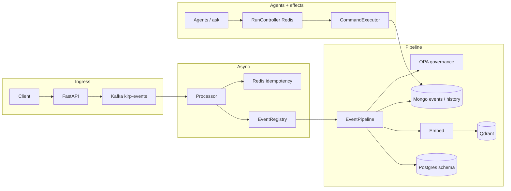

# KIRP

## Executive Technical Brief

**Intelligence OS · execution substrate, not prompts**

| | |
|:---|:---|
| **Version** | 1.0 |
| **Pages** | ~3 (print / PDF) |
| **PDF / dark layout** | [`KIRP_EXECUTIVE_TECHNICAL_BRIEF_PRINT.html`](./KIRP_EXECUTIVE_TECHNICAL_BRIEF_PRINT.html) (open in browser → Print → Save as PDF) |
| **Full thesis** | [`KIRP_INTELLIGENCE_OS_WHITEPAPER.md`](./KIRP_INTELLIGENCE_OS_WHITEPAPER.md) |

---

## Thesis

**Demos reward fluency. Production rewards invariants.**

Agent stacks fail *quietly*: HTTP 200, plausible language, wrong facts. KIRP is an **execution and governance layer** for multi-tenant agent work: **events → Kafka → governed pipeline → multiple stores → runs in Redis → optional agents → audited execution**. Narrow promise: **legible failure, bounded autonomy, operational truth** — not “smarter models.”

---

## Why this exists (now)

Agents are hitting **systems of record** (tasks, calendars, CRM, messaging). That repeats 2010s distributed-systems failure modes — missing consumer idempotency, giant logical boundaries, no honest partial-state story — with higher blast radius. **Prompt orchestration is not systems engineering.** KIRP treats orchestration as **registry + contracts + identity + policy + recovery**.

---

## Architecture (one picture)

---

## Real infra choices (not generic “stack”)

| Layer | Choice | Why it matters |
|:------|:-------|:----------------|
| Ingress / API | FastAPI, JWT tenant context | Identity on every request |
| Async | Kafka + dedicated processor | At-least-once reality, backpressure |
| Dedup | Redis `idempotency:*` TTL | Duplicate delivery is normal |
| Policy | OPA over HTTP | Writes are governable, not vibes |
| Events / timeline | Mongo | Durable narrative of what happened |
| Vectors | Qdrant, tenant-filtered payloads | Searchable memory without cross-tenant bleed |
| Obligations / graph | Postgres + SchemaEngine | Structured truth beside blobs |
| Run lifecycle | Redis `tenant:{id}:{run_id}` | Operators see steps, cost, terminal state |
| LLM routing | `task_type → provider` via env | Auditable spend/latency, not model-chosen routing |
| Side effects | Typed commands + pending approve/reject | Autonomy without silent external mutation |
| Ops signals | Structured logs + Prometheus + run APIs | Incidents answered from graphs, not grep |

---

## Differentiator vs “AI wrappers”

| Typical wrapper | KIRP |
|:------------------|:-----|
| One chat table owns truth | **Events + pipeline** own durable state |
| Retry the LLM, call it “resilience” | **Classify retries**; idempotency where **facts** change |
| Traces = token dumps | **Store outcomes + policy + run state** |
| `/v1/chat` is the product | **Registry, workers, execution, audit** are the product |

---

## Operating philosophy (non-negotiables)

1. **Never translate infra uncertainty into user-facing certainty.**
2. **A hallucinated success is worse than a crashed request** — design error surfaces accordingly.
3. **Autonomous without auditability = unmanaged side effects.**
4. **Duplicates are normal** — consumers and effects must be idempotent where reality changes.
5. **Policy outages are security incidents**, not “skip OPA for now.”

---

## Who should read what

| Reader | Start here | Then |
|:-------|:-------------|:-----|
| VC / busy founder / recruiter | **This brief** | Whitepaper §5–9, §“One real flow” |
| Staff+ engineer evaluating depth | Whitepaper end-to-end | `SYSTEM_ARCHITECTURE.md` |

---

## Closing

We are not optimizing demo wow. We are optimizing **adult engineering**: failures you can see, boundaries you can enforce, recovery you can run without re-prompting an outage away.

**KIRP Intelligence OS** — *full thesis:* [`KIRP_INTELLIGENCE_OS_WHITEPAPER.md`](./KIRP_INTELLIGENCE_OS_WHITEPAPER.md).
