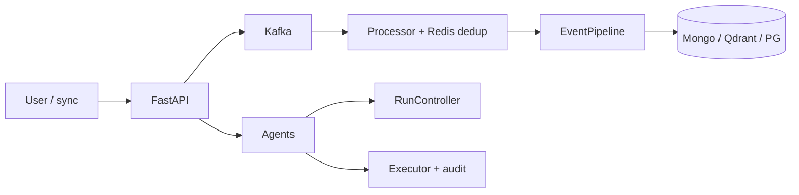
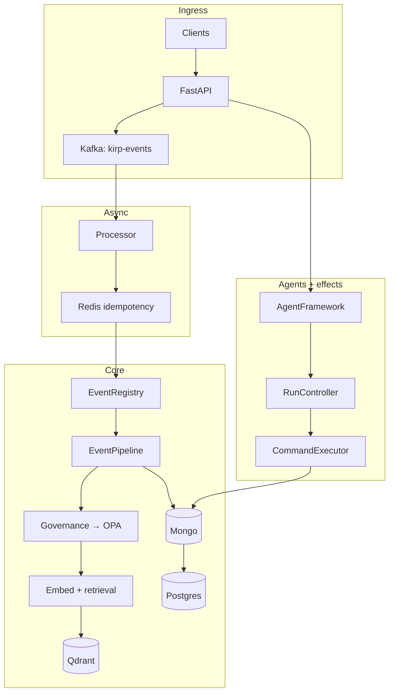
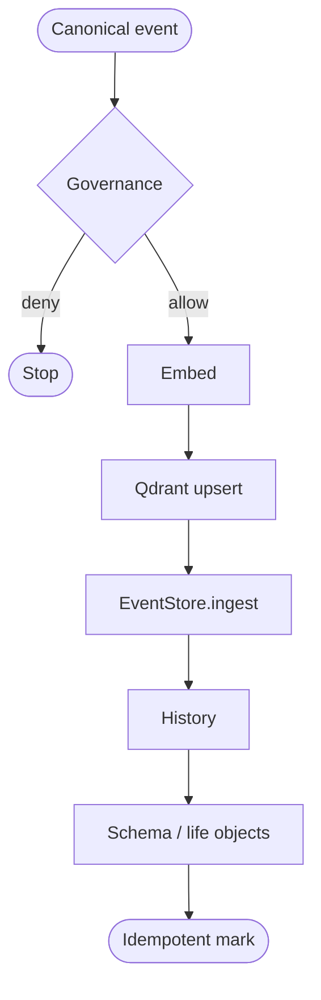
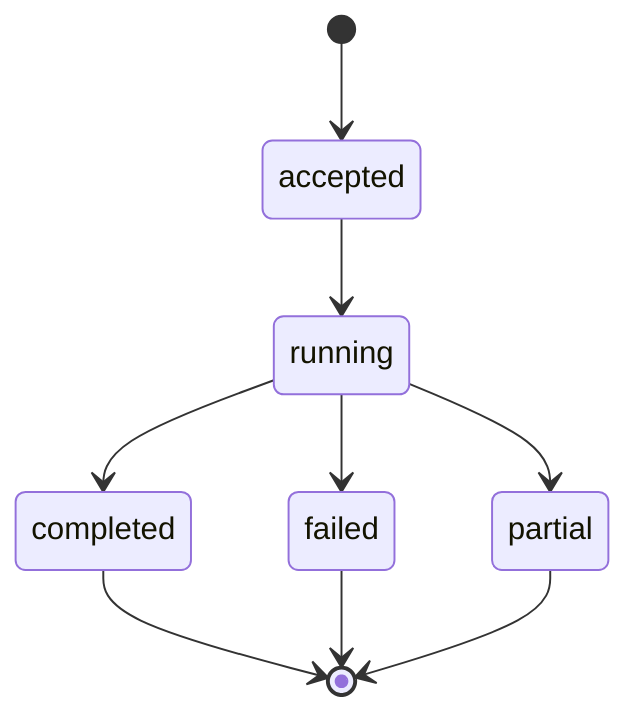
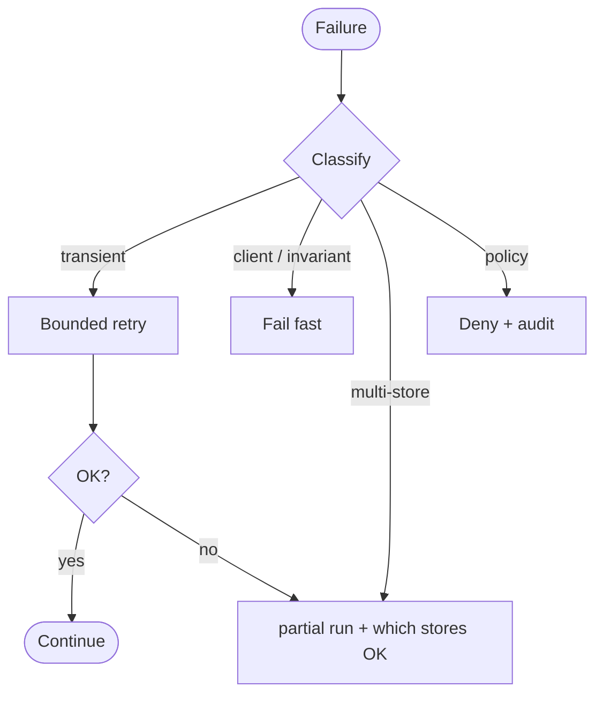

# KIRP Intelligence OS

### Survivable Agentics in Production

**Execution, governance, operational truth**

| | |
|:---|:---|
| **Version** | 1.0-rc.2 |
| **Date** | 2026-05-13 |
| **Kind** | Technical thesis — not marketing |
| **Send first** | **[Executive Technical Brief](./KIRP_EXECUTIVE_TECHNICAL_BRIEF.md)** (~3 pages) |
| **Deep dive** | This document + `SYSTEM_ARCHITECTURE.md`, `SYSTEM_STATUS.md` |

---

## Abstract

Demos reward *fluency*. Production rewards *invariants*.

Agent stacks often fail **quiet**: green metrics, sparse logs, plausible text that is **operationally false**. **KIRP** is an **execution substrate** — event ingress, governed **EventPipeline** across stores, **Kafka** + **Redis** idempotency, tenant-scoped retrieval, **OPA**, **RunController** in Redis, **audited execution** — not “smarter prompts.” Claim: **failures legible, autonomy bounded, recovery runnable** — or fail without lying.

---

## Operating theses

> **Most AI systems do not fail loudly enough.**

> **A hallucinated success response is operationally worse than a crashed request.**

> **Autonomous without auditability is just unmanaged side effects.**

> **Prompt orchestration is not systems engineering.** Orchestration = **registry + contracts + failure semantics + identity + recovery**. The rest is a prototype with invoices.

---

## Glossary

| Term | Definition |
|:----|:-----------|
| **Agent** | Bounded: structured in → (optional LLM) → structured out / queued effects. |
| **Canonical event** | Typed envelope + tenant / space / user; spine of work. |
| **EventPipeline** | Ordered: governance → embed → Qdrant upsert → EventStore → history → schema extraction. |
| **Run** | Lifecycle in Redis: steps, cost, trace, terminal `completed` / `failed` / `partial`. |
| **Deterministic routing** | `task_type → provider/model` from config — not runtime mysticism. |

---

## Why now

Same mistakes as early distributed systems, faster blast radius: hand-waved consistency, missing idempotency on **effects**, one giant **prompt** boundary, “traces” without **store truth**, no SLOs on **semantic** failure.

| 2010s | Agent era |
|:------|:----------|
| “Eventually consistent” hand-wave | “Model will self-correct” |
| No consumer idempotency | No idempotency on **tool writes** |

Agents now touch **calendars, CRM, messaging** — wrong facts in systems of record. KIRP exists because **notebook + vector DB + hope** is operationally immature at tenant scale.

---

## 1 · Executive summary

1. **Thesis.** Classical failures (partition, duplicate, partial write) **plus** **semantic 200s**. KIRP optimizes **failure legibility** and **bounded autonomy**.

2. **Mechanism.** **Events** → Kafka processor → **Redis** dedup → **EventRegistry** → **EventPipeline** (governed multi-store). Agents + **RunController**; execution via typed commands + audit.

3. **Non-goals.** No promise of self-healing magic — **explicit degradation**, isolation, policy, durable traces.

---

## 2 · Core problem

**Silent failure:** wrong row, dropped tool args, fake citations, “done” UI with half a workflow. If monitoring cannot see **wrong-but-200**, you shipped **risk**, not AI.

**Context is three problems:** retrieval (similarity), session (ephemeral), ground truth (events + schema). Smear them → non-replayable runs.

**Observability:** identity, policy outcome, **which stores committed**, run lifecycle, cost — tokens alone **lie**.

---

## 3 · Why production agent stacks break

Multi-store paths without an **honest partial story** invent consistency. Retries on LLM calls **resample**; retries on external writes without keys **duplicate reality**. Side effects without **approval / least privilege** are **automation debt**.

---

## 4 · Design philosophy

| Principle | Refuse |
|:-----------|:-------|
| Events as spine | Ad hoc mutations in agents |
| Identity ambient | Optional `tenant_id` |
| Policy before irreversibility | “OPA later if we remember” |
| Degrade explicitly | Confident UI over broken vectors |
| Runs as surface | Opaque spinners |
| Routing is config | Model-picked providers |

---

## 5 · Real system characteristics

| Concern | How KIRP does it |
|:--------|:-----------------|
| **Ingest** | API enqueues **Kafka** (`kirp-events`); processor → **CanonicalEvent** → **EventRegistry.dispatch**. |
| **Async** | Consumer + **Celery** for scheduled / batch work off hot path. |
| **Replay** | Durable Mongo events + documented re-embed / re-upsert; **full auto-replay** = roadmap, not pretense. |
| **Isolation** | Qdrant filters; JWT-scoped APIs; Redis runs `tenant:{tenant_id}:{run_id}`. |
| **Observability** | Structured logs, Prometheus, run APIs/streams, LLM usage/cost. |
| **Idempotency** | Redis `idempotency:*` TTL; HTTP keys on selected flows; stable `external_id` on integrations. |
| **Recovery** | Vector down → events may persist, search degrades; embed/LLM fail **per event / task_type**; OPA fail = **governance incident**. |
| **Orchestration** | Registry + **EventPipeline** + agent graph + **execute_command** → **execution** events. |

---

## 6 · One real flow (credibility anchor)

**Path:** async **ingest** → pipeline → optional **agent** work → **execution** with audit.

| # | Step | Component | Failure surface | Partial / recovery |
|:--|:-----|:----------|:------------------|:-------------------|
| 1 | User / integration submits content | FastAPI | Auth / validation | 4xx, no enqueue |
| 2 | Envelope to **Kafka** | `KafkaEventAgent` | Broker / serialize | Retry producer; user may see OK but delayed |
| 3 | Consumer sees message | `kafka_processor` | Poison / lag | Retry policy at message boundary |
| 4 | **Redis** idempotency check | `idempotency:{key}` | Redis flake | Re-read / skip duplicate path |
| 5 | **CanonicalEvent** + **EventRegistry.dispatch** | registry | Unknown type | Dead-letter / structured error |
| 6 | **GovernanceEngine** → **OPA** | governance | OPA timeout / deny | Deny or fail-closed; **no “skip policy”** |
| 7 | Embed + **Qdrant** upsert | `RAGEngine` | Embed or vector down | Event may still land Mongo; **searchable lag** |
| 8 | **EventStore.ingest** + **record_history** | Mongo | Write timeout | **Partial**: event vs timeline skew — documented in failure map |
| 9 | Life objects + **SchemaEngine.upsert** | Postgres | Constraint / DB | Partial schema vs event — operator replay |
| 10 | Mark idempotent processed | Redis TTL | Missed mark | At-least-once replay risk → design idempotent handlers |
| 11 | (Later) **Agent** / **Insight** / scheduler reads stores | AgentFramework | LLM / RAG | Run → `failed` / `partial`; steps appended |
| 12 | **RunController** admits run | Redis keys | Redis partition | Runs stale — ops treat as infra incident |
| 13 | **ExecutionAgent** → **execute_command** | Notion / Slack / … | External API | Pending + approve/reject; **execution** event with result |

**Rule:** **never** turn infra uncertainty into user-facing certainty — surface **degraded** / **partial** / **hard fail** with evidence.

---

## 7 · System architecture

| Path | Win | Pay |
|:-----|:----|:----|
| Kafka ingest | Dedup, burst isolation | E2E latency harder per user |
| Sync `/ask`, `/m3/reflect` | Simple UX | Full dependency chain in user latency |

---

## 8 · Event pipeline

---

## 9 · Run lifecycle

---

## 10 · Failure handling (operator model)

---

## 11 · Reliability principles

At-least-once consumers. Idempotency where **facts** change. OPA down = governance incident. Test wires, processor retries, run keys, metrics. **Document partials** — no 3am archaeology.

---

## 12 · Failure scenarios (short)

| Case | First symptom | Good response |
|:-----|:--------------|:----------------|
| Qdrant down | Search empty | Events durable; replay vectors |
| Embedder flaky | New chunks not indexed | Metrics + backlog |
| Duplicate Kafka | Double effects | Redis dedup + stable external IDs |
| Policy deny | Blocked write | Before irreversible commit; reason logged |
| Long job | User retries | Run steps visible |

---

## 13 · Honest mapping

| Pain | Response |
|:-----|:---------|
| Duplicate delivery | Redis idempotency TTL |
| Split brain | Pipeline order + documented partials (`SYSTEM_ARCHITECTURE.md`) |
| Ungoverned writes | OPA |
| Silent execution | Typed commands, approve/reject, execution events |
| Black-box cost | Usage + run cost |
| Mystery routing | Env-driven `task_type` routing |

**Non-claim:** per-request random LLM failover ≠ reliability; prefer **visible fail** + ops.

---

## 14 · Not a wrapper

One chat table ≠ product. **Events + registry + pipeline + runs + audit** = product.

---

## 15 · Future (still boring)

Replay jobs Mongo → embed → Qdrant. Retrieval fingerprints on runs. **Per-stage SLOs.** Policy versioning / migration.

---

## 16 · Roadmap (indicative)

| H | Ship |
|:--|:-----|
| H0–H1 | SLOs + runbooks from failure map |
| H1 | Replay metrics + jobs |
| H1–H2 | Integration tests on envelopes |
| H2 | Retrieval IDs in run steps |
| H2–H3 | Policy migration tooling |

---

## 17 · Founder notes

I am tired of demos that **die quietly** in production — dashboards green, business wrong.

**Why me / why this:** I came at this from **frustration with brittle agent stacks** that worked in a controlled demo and **collapsed under real tenants, real integrations, and real partial failures** — not from a desire to ship more “AI theater.” I care more about **operational truth** (what persisted, under what policy, with what evidence) than about maximal model cleverness. This is an **obsession with reliability** as shipped behavior, not as a landing-page bullet.

The field shipped agents like microservices in 2014: enthusiasm before invariants. KIRP bets the next serious products treat the model as an **unreliable node** in a **mostly reliable system** — **Kafka, Redis, policy, and runs**, not a longer system prompt.

---

## 18 · Closing

**Adult engineering:** failures visible, boundaries enforceable, recovery **runnable** without prompting through an outage.

---

## Document control

| Field | Value |
|:------|:------|
| Version | 1.0-rc.2 |
| Reviewers | Backend, security, ML platform |
