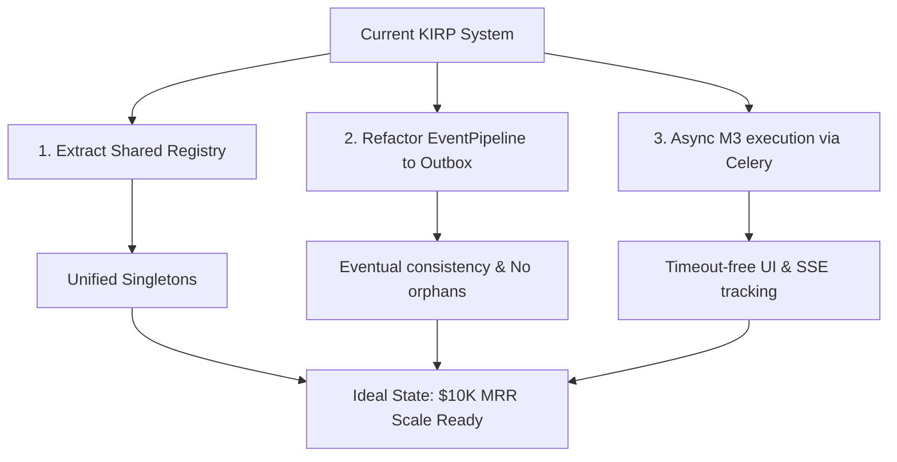

# KIRP System Gap Analysis: Current vs. Ideal State

This document provides a highly rigorous, technical evaluation of the current KIRP backend and frontend codebase, highlighting structural weaknesses, consistency gaps, and recommendations to reach production readiness.

---

## 1. Architectural & Consistency Gaps

### 1.1 Cross-Store Projection Consistency (Qdrant, Mongo, Postgres)
* **Current State:** The `EventPipeline.run` execution is sequential and best-effort. If Qdrant vector upsert succeeds (Step 2) but MongoDB event ingestion fails (Step 3), an orphan vector exists in Qdrant with no backing MongoDB event. If MongoDB succeeds but PostgreSQL schema engine fails (Step 5), the event exists but is missing from the Postgres graph database.
* **Ideal State:** **Reliable Transactional Outbox Pattern** or **Saga Pattern**. Projections should be driven by a reliable outbox ledger. Write to MongoDB (the source of truth) and emit projection tasks to Celery. If a projection fails, Celery retries it automatically, guaranteeing eventual consistency without leaving orphan vectors or missing PostgreSQL nodes.
* **Impact:** High. Data drift between Qdrant, Mongo, and Postgres breaks search accuracy and relational graphs.

### 1.2 Idempotency Fragmentation
* **Current State:** Idempotency is split into two disjointed systems:
  * Kafka events use Redis keys (`idempotency:{key}`) with a 1-hour TTL in `kafka_processor.py`.
  * M3 reflection HTTP requests use MongoDB collection-based tracking (`m3_idempotency` collection) in `v1_m3.py`.
* **Ideal State:** A unified **Idempotency Service** (`src/core/idempotency.py`) using Redis as the primary hot cache and MongoDB as a persistent fallback, exposing a single decorator or context manager for both HTTP routes and Kafka consumers.
* **Impact:** Medium. Code duplication and inconsistent behavior across ingress channels.

### 1.3 Duplicated Engine & Client Initialization
* **Current State:** Database connections (Mongo, Postgres), Qdrant clients, RAG engines, Schema engines, and OPA governance clients are initialized independently and repeatedly in `main.py`, `kafka_processor.py`, `event_registry_handlers.py`, and `modules/m3/handlers.py`.
* **Ideal State:** A unified **Dependency Injection (DI)** or **Service Registry** (`src/core/registry.py`) providing singleton instances of all clients and engines, instantiated once on application startup.
* **Impact:** Medium. Increased memory usage, connection leaks under load, and configuration drifts.

### 1.4 Logical Tenant Isolation in Qdrant
* **Current State:** A single Qdrant collection is shared across all tenants, relying on filter queries (`Filter(must=[FieldCondition(key="tenant_id", match=MatchValue(value=tenant_id))])`) to enforce separation.
* **Ideal State:** **Physical Tenant Isolation** or dynamic namespace separation. Under high security standards, tenants should have individual collections, preventing cross-tenant leaks due to developer query bugs.
* **Impact:** High (Security compliance).

---

## 2. Execution & Operational Gaps

### 2.1 Synchronous M3 Reflection Pipeline
* **Current State:** `POST /api/v1/m3/reflect` executes the entire pipeline (embedding, Mongo, Postgres) followed by four separate LLM agents (`ReflectionClassifierAgent`, `GapAnalysisAgent`, `MicroActionGeneratorAgent`, `IdentityDiscriminatorAgent`) synchronously. A single slow LLM call will timeout the HTTP request.
* **Ideal State:** Ingest the reflection, save the event, return `201 Accepted` immediately with a `run_id`, and delegate the agent execution stages to Celery background workers. The frontend can monitor progress asynchronously via SSE (`/api/v1/run/{run_id}/status/stream`) or WebSocket.
* **Impact:** High (Scalability and UX responsiveness).

### 2.2 Lack of Structured E2E Verification & Test Harness
* **Current State:** Verification relies on shell scripts (`TEST_E2E.sh`, `check_kirp.sh`) that trigger curls and run pytest. There is no automated framework verifying both the database state consistency post-run and UI rendering matching design specs.
* **Ideal State:** A unified test harness using **Pytest** for backend integration and **Playwright/Cypress** for UI layout validation.
* **Impact:** Medium.

---

## 3. Recommended Actions to Reach the Goal

1. **Service Registry (`src/core/registry.py`):** Write a central module managing database and vector store clients to eliminate duplicate initialization code.
2. **Transactional Outbox for Projections:** Modify `EventPipeline.run` to write to MongoDB first. Let a background task or Celery consumer read the event and run `Qdrant` and `Postgres` projections reliably.
3. **Decouple M3 Stage Runs:** Modify `v1_m3.py` to run `run_m3_stages` in Celery, returning the `run_id` instantly.
4. **Unified Idempotency Provider:** Create a single utility for idempotency verification.
